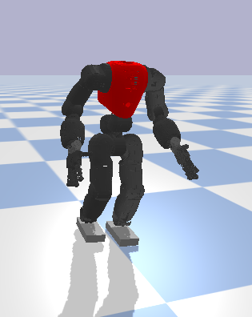

# HumanoidWalking

In this repository, you'll find one of the key components of my [PhD research](https://ria.ua.pt/bitstream/10773/33545/1/Documento_Seyed_Kasaei.pdf): a straightforward and effective method for creating walking gaits in humanoid robots. Our strategy blends the Linear Inverted Pendulum Model (LIPM) with Central Pattern Generators (CPG) to craft a unique walk engine. This engine utilizes a state machine to oversee the robot's walking cycle, generating smooth walking paths through a combination of Partial Fourier Series (PFS) oscillators and stabilizing controllers. This repository offers a glimpse into a larger body of work dedicated to advancing the field of humanoid robotics, showcasing a practical and efficient approach to robot locomotion as part of my doctoral journey. I have deployed the walking engine on different platforms including CoMAN, Talos and Nao.

 
 


# Installation and Setup

## Clone the Repository:

```
git clone git@github.com:MohammadKasaei/HumanoidWalking.git
cd HumanoidWalking
```
## Set Up a Virtual Environment (optional):

```
python3 -m venv env
source env/bin/activate  # On Windows use `env\Scripts\activate`
```
## Install Dependencies:
Before running the script, make sure you have execute permissions. Run the following command:
```
chmod +x install_dependencies.sh
```
To install all the dependencies, simply run:
```
./install_dependencies.sh
```
Wait for the script to complete. Once done, all the required dependencies should be installed in your environment.


## Usage 
Instructions on how to run the code, experiments, and reproduce results.
```
python3 Coman_CPG.py
```
Once everything successfully installed, you'll see the simulated CoMAN while walking forward within the PyBullet simulator.


Additionally, by running the following command, you'll see the simulated Talos robot performing omnidirectional walking.
```
python3 Talos_CPG.py
```


