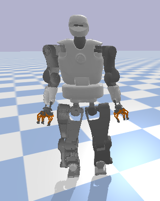

# HumanoidWalking - CPG and DRL
<div align="center">
  
</div>

## 🧠 Deep Reinforcement Learning (DRL) Control

This repository integrates **model-free reinforcement learning** with a **CPG-based gait engine** to refine and stabilize humanoid locomotion. The DRL agent learns residual control actions on top of the model-based gait generation, improving adaptability, energy efficiency, and robustness under disturbances.

### 🏗️ Architecture Overview

- **Hybrid Policy Control**:
  - **Model-Based Backbone**: Core trajectory generation relies on a Central Pattern Generator (CPG) to produce smooth walking cycles.
  - **Residual RL Actions**: A DRL policy provides real-time adjustments to joint torques, correcting for external perturbations, modeling errors, or unstructured terrain.

- **Control Target**:
  - The RL outputs modulate:
    - **Torso orientation** (Waist joints)
    - **Hip, knee and ankle joints** (for balance)
    - **Arm swing and shoulder/elbow joints** (for dynamic stability and momentum compensation)

### 🎯 Reward Function Design

The reward function is carefully engineered to guide learning toward stable and purposeful walking:

```python
Reward = +DistanceImprovement + OrientationImprovement + Bonus - 0.1 * EnergyPenalty
```

- **Distance Improvement**: Reward for moving closer to the target position.
- **Orientation Improvement**: Encourages aligning torso orientation with a desired angle.
- **Bonus**:
  - +0.5 if the robot reaches the target position.
  - +0.5 if the robot aligns closely with the desired orientation.
- **Energy Penalty**: Penalizes high-magnitude actions, scaled differently for:
  - Torso rotation
  - Hip and ankle joints
  - Arm joints

> Additional penalties can be incorporated to encourage smoother motion, including terms for foot impact, torque, motor velocity, joint acceleration, and action change penalties (e.g., r(aₜ, aₜ₊₁)).
> 
> The reward is normalized (scaled by 0.01) and truncated if the robot falls (e.g., torso height < 0.37m or hands touch the ground).

### 🔍 Observation Space

The observation includes:

- **Joint-Level Data**: 23 joints × (position, velocity, torque)
- **Base Motion**: Linear and angular velocities (in torso frame)
- **Torso Height**
- **Gravity Vector** (in local frame)
- **Foot Contact Info**: Center of Pressure (CoP) and contact forces
- **Task Objective**:
  - Relative position and orientation to the navigation goal
- **Phase Counter**: Helps the agent synchronize with gait phase

> All observations are symmetrized to exploit bilateral symmetry in walking dynamics.


### 🦿 Humanoid Robot Walking Engine

 This is the **core component** of our **end-to-end walking pipeline**, developed as part of my [PhD research](https://ria.ua.pt/bitstream/10773/33545/1/Documento_Seyed_Kasaei.pdf). It presents a robust framework for generating walking gaits in humanoid robots.

#### 🔧 Key Features:
- 🚶‍♂️ **Hybrid Walking Engine**: Combines the **Linear Inverted Pendulum Model (LIPM)** with **Central Pattern Generators (CPGs)** for trajectory generation.
- 🧠 **State Machine Control**: A modular finite-state machine orchestrates the phases of the walking cycle.
- 🔄 **Smooth Gait Generation**: Utilizes **Partial Fourier Series (PFS) oscillators** to produce smooth and continuous joint trajectories.
- 🛠️ **Stabilization Controllers**: Includes feedback mechanisms for dynamic stability during locomotion.
- 🤖 **Multi-Platform Deployment**: Successfully deployed on multiple humanoid platforms including:
  - **COMAN**
  - **Talos**

This implementation is a cornerstone of my doctoral work and contributes to the broader goal of enabling reliable, dynamic locomotion in humanoid robots.

<div style="display: flex; justify-content: space-between; align-items: center;">
  
  
</div>


# Installation and Setup

## Clone the Repository:

```bash
git clone https://github.com/MohammadKasaei/HumanoidWalking.git
cd HumanoidWalking
```

## Set Up a Virtual Environment (optional):

```bash
python3 -m venv walking_env
source walking_env/bin/activate  # On Windows use `walking_env\Scripts\activate`
```

## Install Dependencies:
Before running the script, make sure you have execute permissions. Run the following command:

```bash
chmod +x install_dependencies.sh
```

To install all the dependencies, simply run:

```bash
./install_dependencies.sh
```

Wait for the script to complete. Once done, all the required dependencies should be installed in your environment.


## Usage 
Instructions on how to run the code, experiments, and reproduce results.

```bash
python3 Coman_CPG.py
```

Once everything successfully installed, you'll see the simulated COMAN while **walking forward** within the PyBullet simulator.

<div align="center">
  
</div>

Additionally, by running the following command, you'll see the simulated Talos robot performing **omnidirectional walking**.

```bash
python3 Talos_CPG.py
```

<div align="center">
  
</div>


### Using the Custom Gym Environment

You can use the COMAN environment located at `Agents/gym_coman.py` as a standard OpenAI Gym-compatible interface for training and evaluation:

```python
from Agents import gym_coman

env = gym_coman.HumanoidGym()
obs = env.reset()

done = False
while not done:
    action = env.action_space.sample()  # replace with your RL agent's action
    obs, reward, done, info = env.step(action)

env.close()
```

Make sure to create a host-specific config file (e.g., `config_<hostname>.txt`) in the root directory as expected by the environment.


## Citation
If you find our work useful in your research, please consider citing:

```bibtex
@article{kasaei2021robust,
  title={Robust biped locomotion using deep reinforcement learning on top of an analytical control approach},
  author={Kasaei, Mohammadreza and Abreu, Miguel and Lau, Nuno and Pereira, Artur and Reis, Luis Paulo},
  journal={Robotics and Autonomous Systems},
  volume={146},
  pages={103900},
  year={2021},
  publisher={Elsevier}
}

@article{kasaei2023learning,
  title={Learning hybrid locomotion skills—Learn to exploit residual actions and modulate model-based gait control},
  author={Kasaei, Mohammadreza and Abreu, Miguel and Lau, Nuno and Pereira, Artur and Reis, Luis Paulo and Li, Zhibin},
  journal={Frontiers in Robotics and AI},
  volume={10},
  pages={1004490},
  year={2023},
  publisher={Frontiers}
}
```
